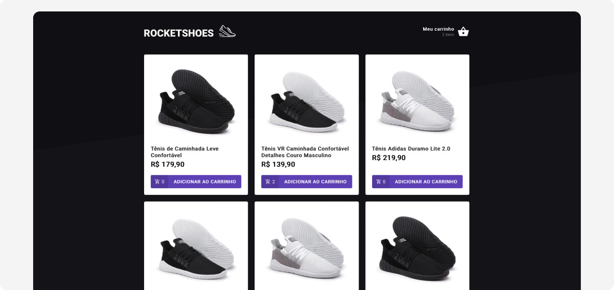
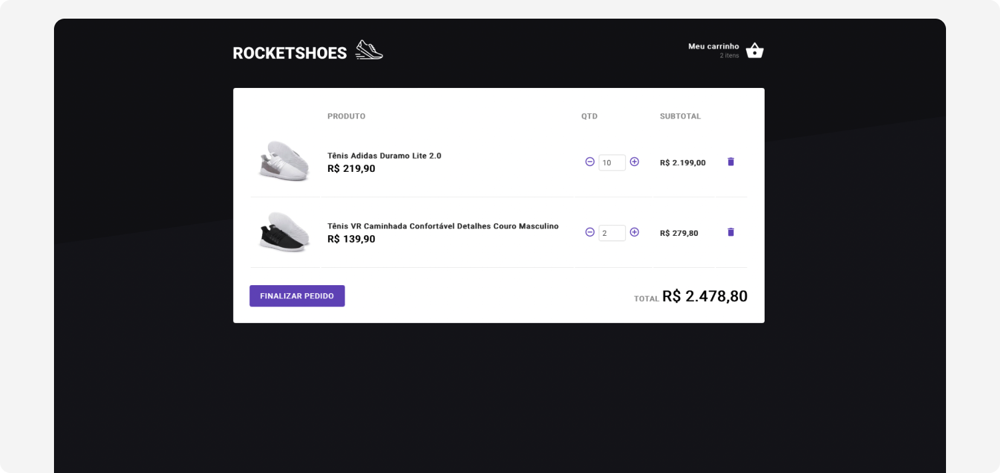

# Rocketshoes App - Exercise 4 from Ignite

During this exercise we simulated an ecommerce shopping cart and its basic features - add, update and remove products -, plus using local storage to persist data and save user's shopping cart state.

Concepts and tools:

- Type annotation with Typescript
- React components
- Toast notifications with Toastify
- React hooks (useState, useEffect, useContext)
- Unit tests with JestJs
- Styled Components
- Consuming fake API with Axios

 

Implemented features:

- Products listing
- Consuming data from API and checking for product availability
- Adding and updating product amount in the shopping cart
- Notifying the user when a product is out of stock
- Persisting shopping cart data in local storage

 

## Project screenshots

 
 
 
